# Legacy Bornomala_School System Visual Map

This document provides visual Mermaid diagrams representing the architecture, module hierarchy, process flows, and entities of the legacy Bornomala_School school management system.

## Section 1: System Module Hierarchy

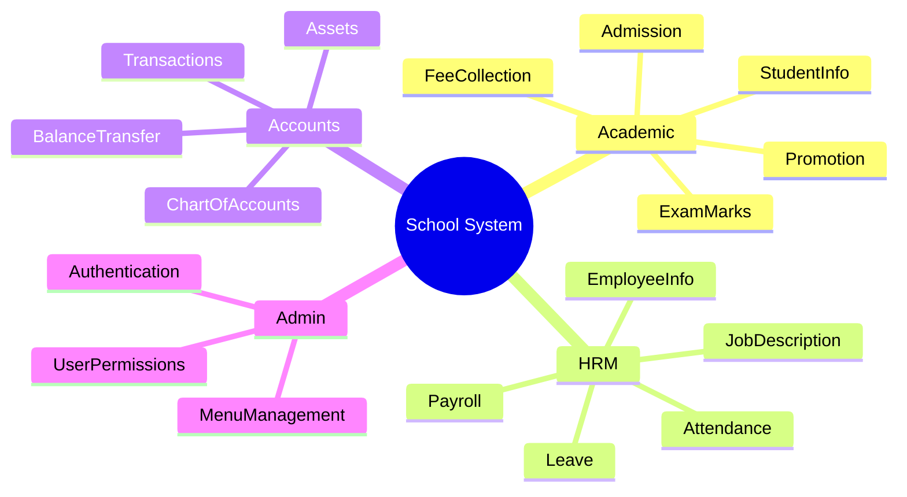

## Section 2: User Role & Permission Map

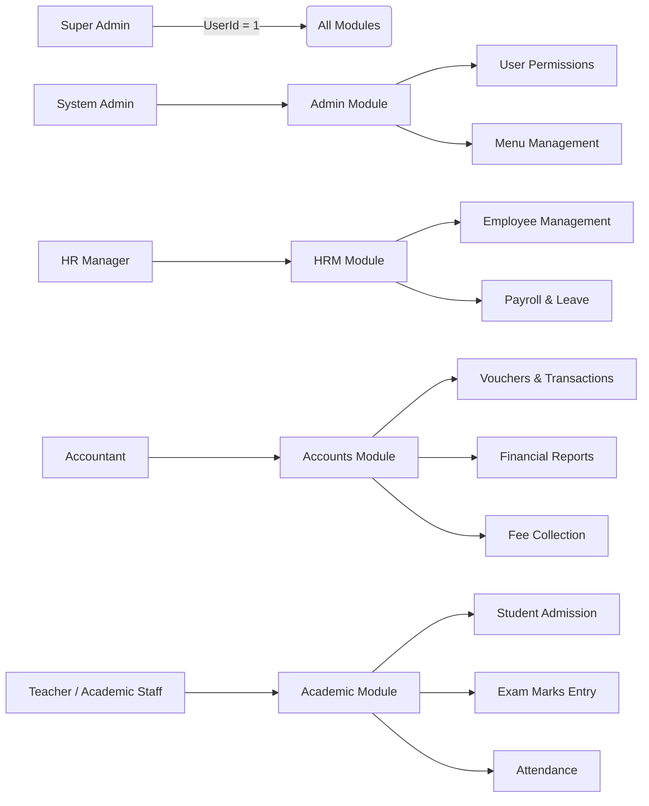

## Section 3: Authentication & Session Flow

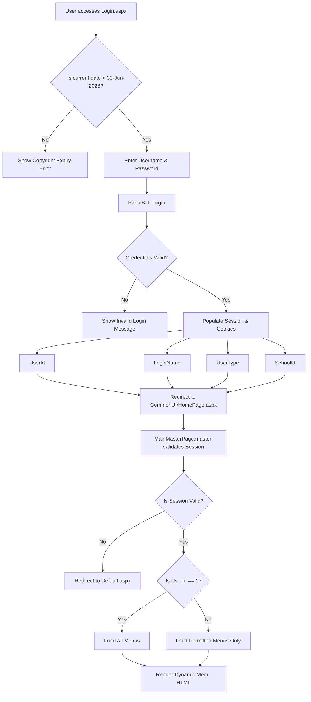

## Section 4: Navigation Menu Tree

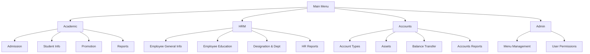

## Section 5: Academic Module Process Flows

### Student Admission Flow
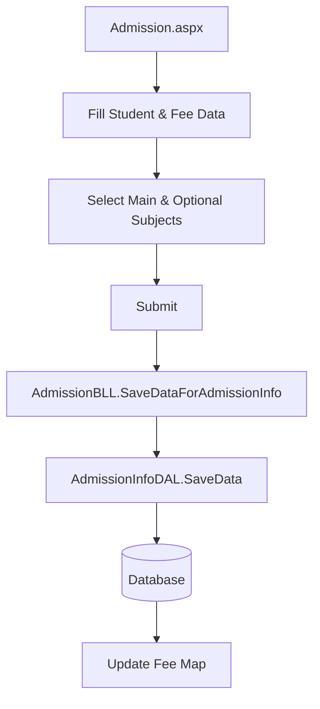

### Exam Marks Entry & Result Processing Flow
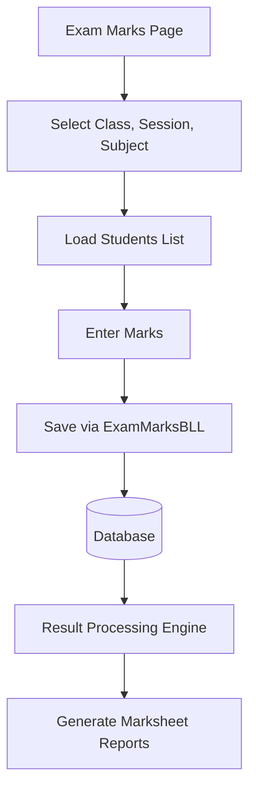

### Fee Collection Flow
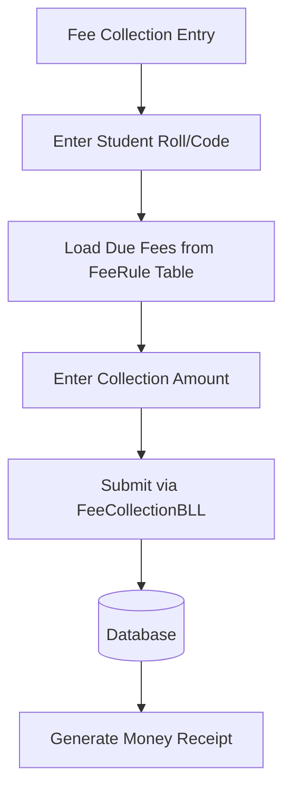

### Student Promotion/Transfer Flow
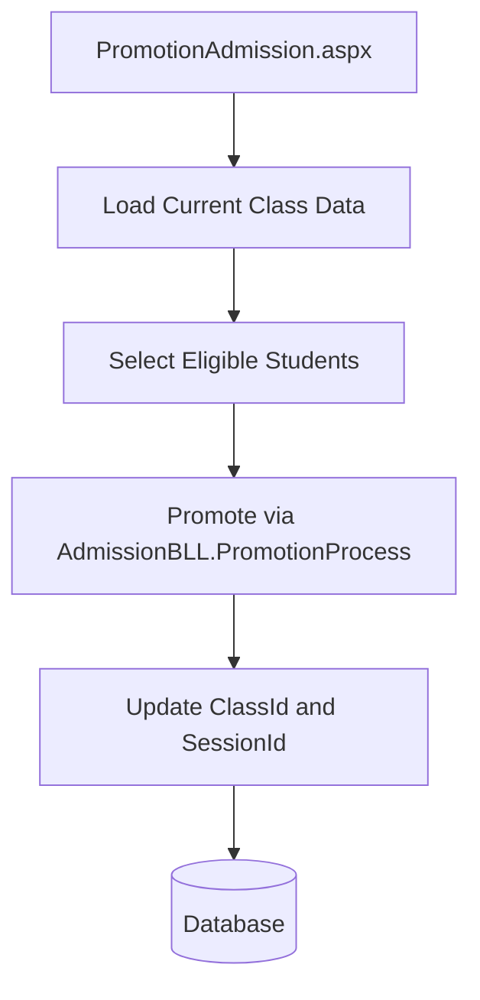

### Attendance Recording Flow
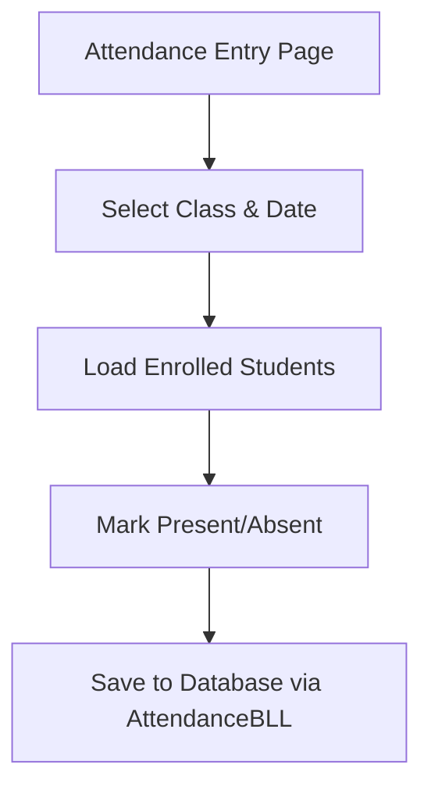

## Section 6: HRM Module Process Flows

### Employee Registration Flow
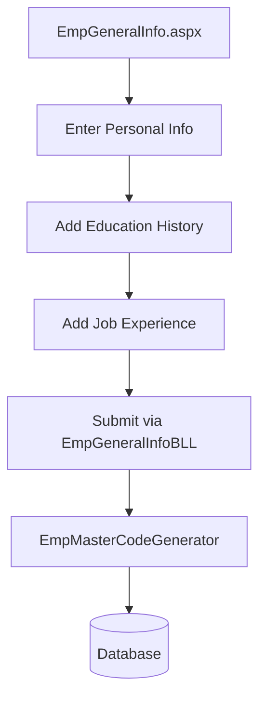

### Daily Attendance Processing Flow
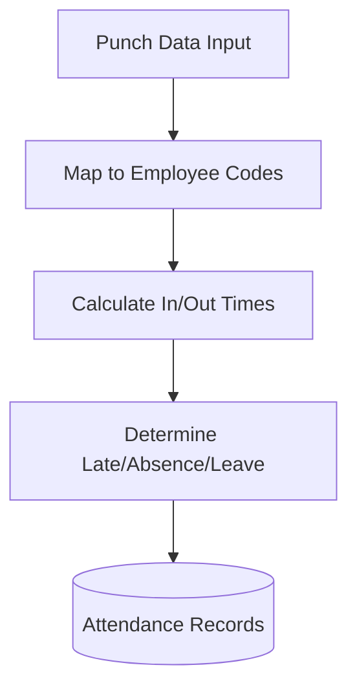

### Payroll/Salary Calculation Flow
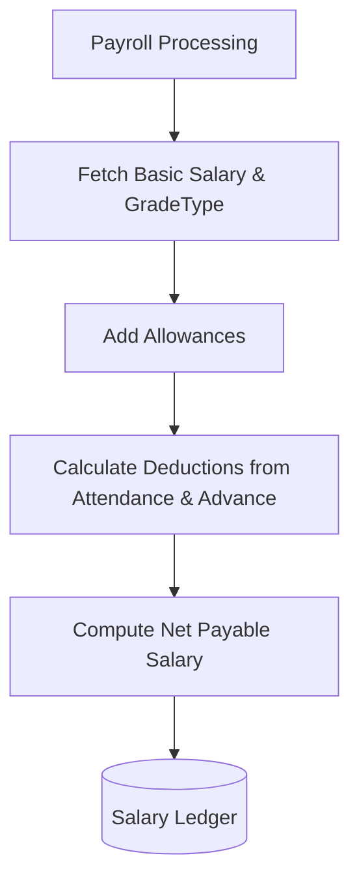

### Leave Management Flow
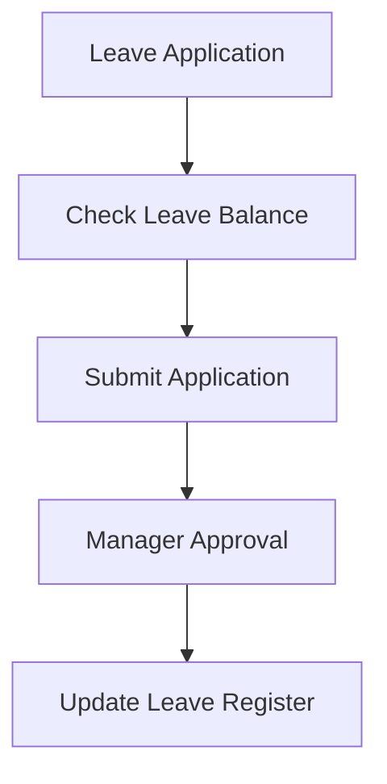

### Advance Salary Approval Flow
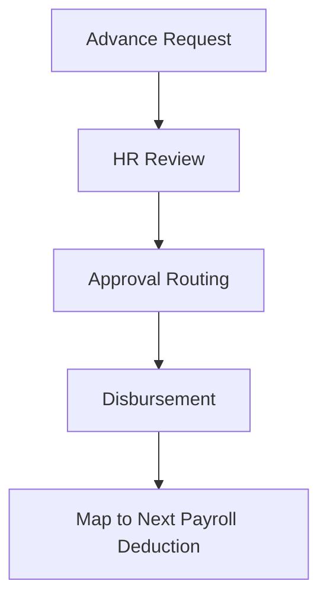

## Section 7: Accounts Module Process Flows

### Chart of Accounts Setup Flow
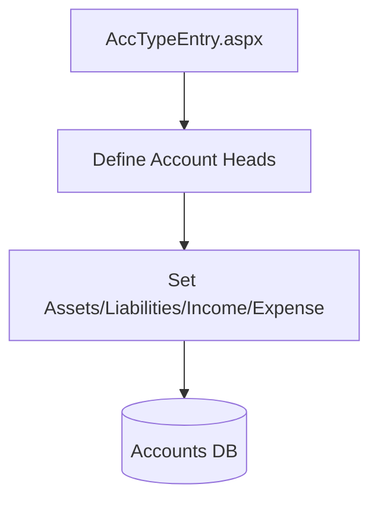

### Payment/Transaction Entry Flow
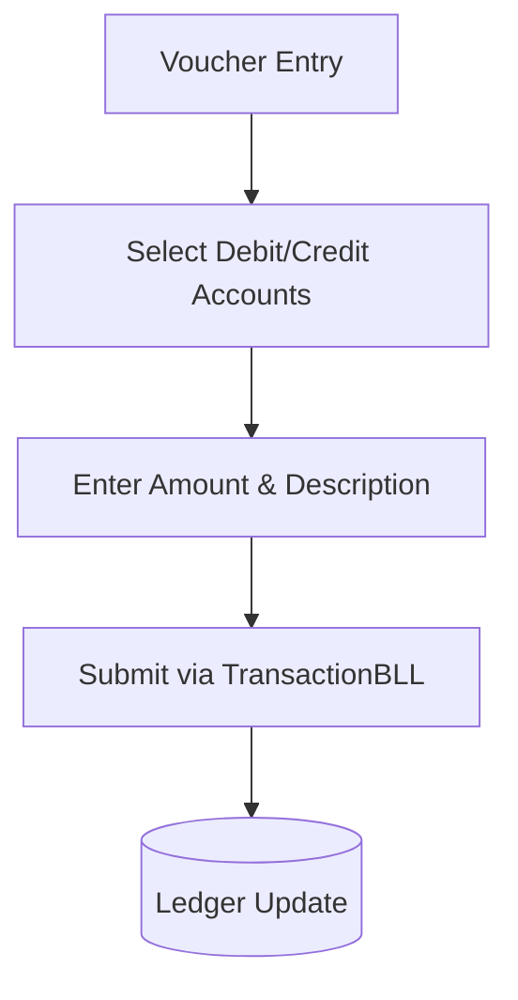

### Balance Transfer Flow
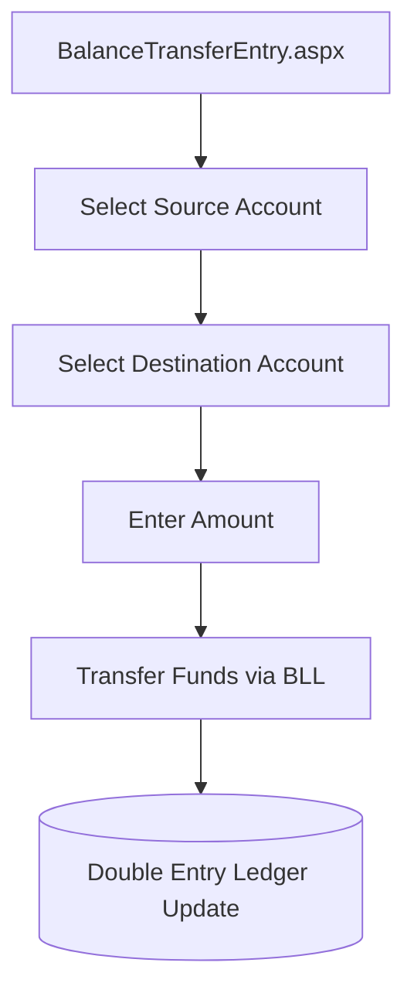

### Financial Reporting Flow
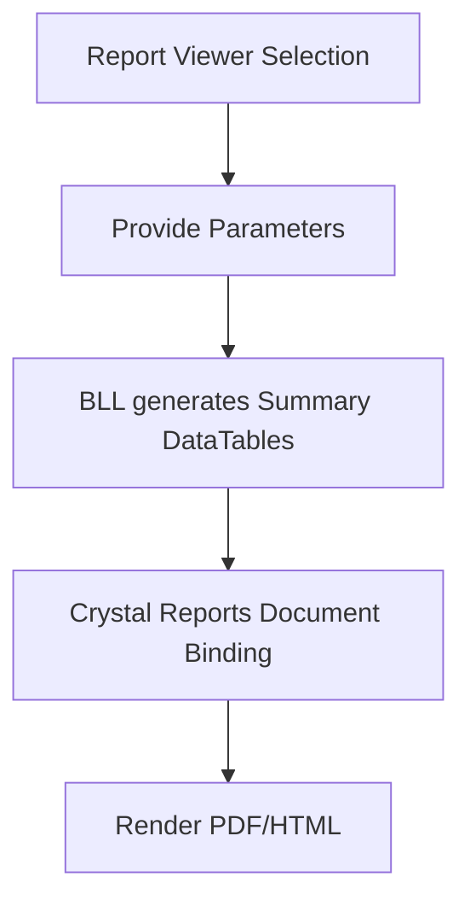

## Section 8: Entity Relationship Diagram

```mermaid
erDiagram
    STUDENT {
        int StudentId PK
        string StudentCode
        string StudentName
        int ClassId FK
    }
    CLASS {
        int ClassId PK
        string ClassName
    }
    SECTION {
        int SectionId PK
        int ClassId FK
    }
    DEPARTMENT {
        int DeptId PK
    }
    FEE_COLLECTION {
        int CollectionId PK
        int StudentId FK
        decimal Amount
    }
    EMPLOYEE {
        int EmpInfoId PK
        string EmpMasterCode
        string EmpName
        int DeptId FK
        int DesigId FK
    }
    SALARY {
        int SalaryId PK
        int EmpInfoId FK
        decimal NetPay
    }
    ACCOUNT {
        int AccountId PK
        string AccountType
    }
    TRANSACTION {
        int TransId PK
        int AccountId FK
        decimal Amount
    }
    USER {
        int UserId PK
        string LoginName
    }
    MENU {
        int MenuId PK
        string MenuName
    }
    PERMISSION {
        int PermissionId PK
        int UserId FK
        int MenuId FK
    }

    STUDENT }|--|| CLASS : enrolled_in
    STUDENT }|--|| SECTION : belongs_to
    STUDENT }|--|| DEPARTMENT : belongs_to
    STUDENT ||--o{ FEE_COLLECTION : pays
    EMPLOYEE }|--|| DEPARTMENT : belongs_to
    EMPLOYEE ||--o{ SALARY : receives
    ACCOUNT ||--o{ TRANSACTION : tracks
    USER ||--o{ PERMISSION : has
    PERMISSION }|--|| MENU : allows
```

## Section 9: Page Navigation Map

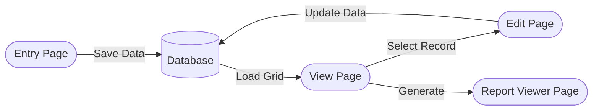

## Section 10: Crystal Reports Architecture

```mermaid
flowchart TD
    UI[Report Viewer UI .aspx] -->|QueryString / Form Params| Param(User Parameters)
    Param --> BLL[BLL Method]
    BLL --> DAL[DAL Method]
    DAL --> DB[(MSSQL Database)]
    DB -->|SQL Queries / SPs| DAL
    DAL -->|DataTable| BLL
    BLL -->|SetDataSource| CR[Crystal Report Document .rpt]
    CR --> Viewer[CrystalReportViewer Control]
```

## Section 11: Legacy Architecture Overview

```mermaid
flowchart TD
    UI[UI Layer - WebForms .aspx / .aspx.cs]
    BLL[Business Logic Layer - .cs]
    DAL[Data Access Layer - .cs]
    DB[(MSSQL Database - Stored Procedures)]

    UI -->|DTO / Entity Objects| BLL
    BLL -->|DTO / Entity Objects| DAL
    DAL -->|ADO.NET SqlClient| DB
    DB -->|SqlDataReader / SqlDataAdapter| DAL
    DAL -->|DataTables / Lists| BLL
    BLL -->|Data Binding| UI
```
